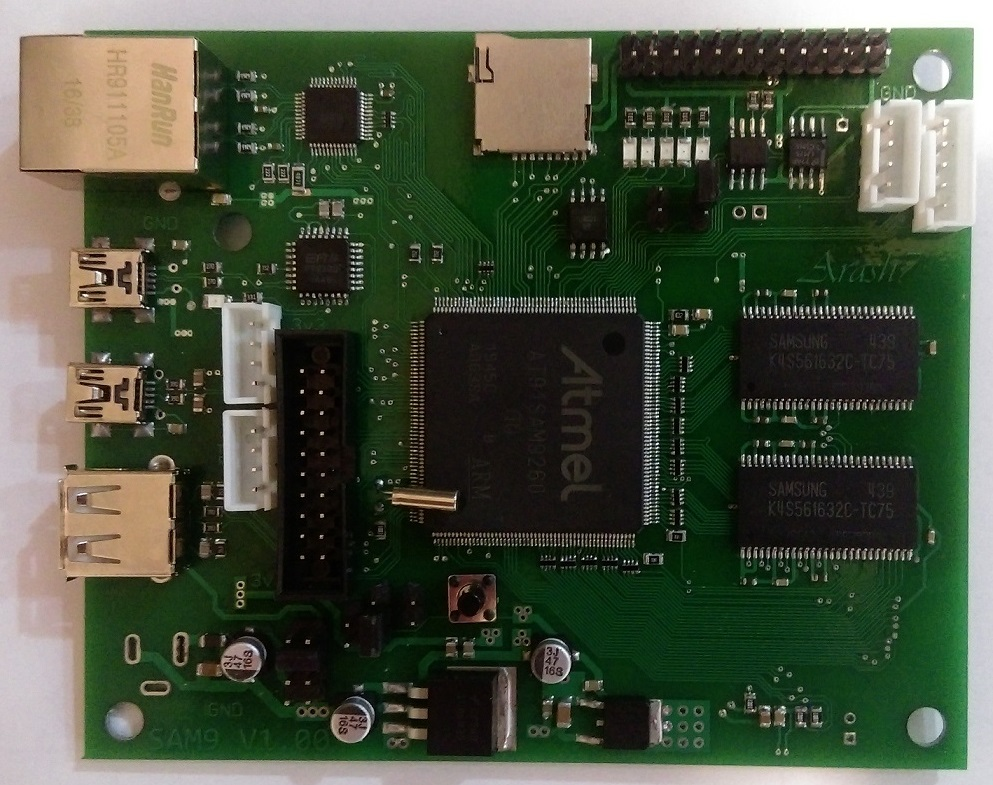
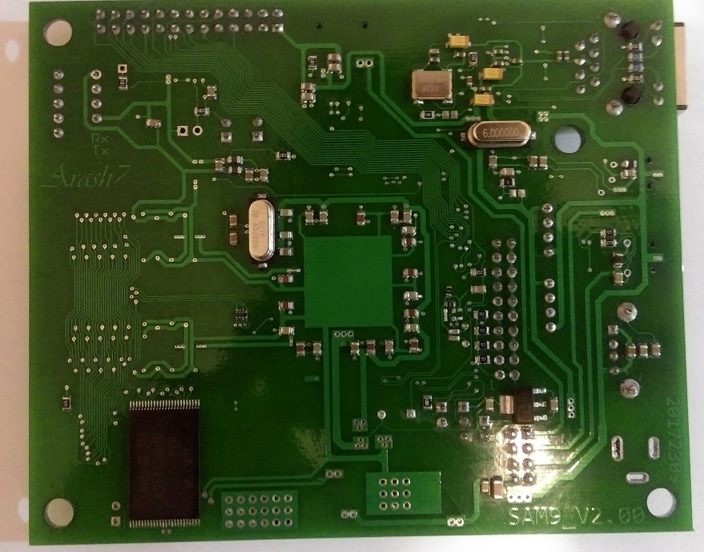

# Introduction

*SAM9-EVAL* is an evaluation board based on at91sam9260 Atmel SoC. It has an old ARM926EJS core. But because of it QFP208 package, you can have your own evaluation board with simple 2 layer PCB.

That'a what I've done!

## Specification

- AT91SAM9260 SoC (ARM926EJS core)
- 64 Mbytes SDRAM
- 256 Mbytes NAND flash 
- 4 Mbytes Atmel Data Flash
- DP83848 Ethernet physical layer
- FT232BL USB to serial converter 
- µSD card slot

# History 

First version of board (V1.00) had major problems

1. Signal integrity issue in SDRAM data
2. Power integrity issue in SDRAM power/ground path
3. Ethernet RX path

After lot of struggling, I could make it working in half of SDRAM nominal frequency.

More information can be find in `Documents/Sam9-eval.one` 

# Notes

1. For using [at91bootstrap](https://github.com/linux4sam/at91bootstrap) , you **must** change *recovery button* form **PA31** to **PB23**. Unless otherwise after flashing `at91bootstrap`, you can not clear it!

   Check `Source Code/change_recovery_button_form_PA31_to_PB23.patch` for more information.

2.  Before any decision about this board, as good friend said: **Check it yourself** !
3. And ... Have fun ...